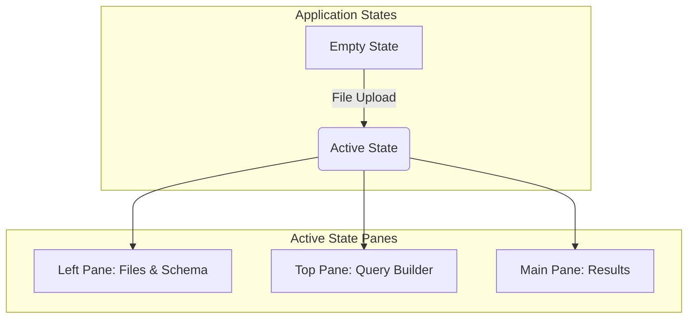
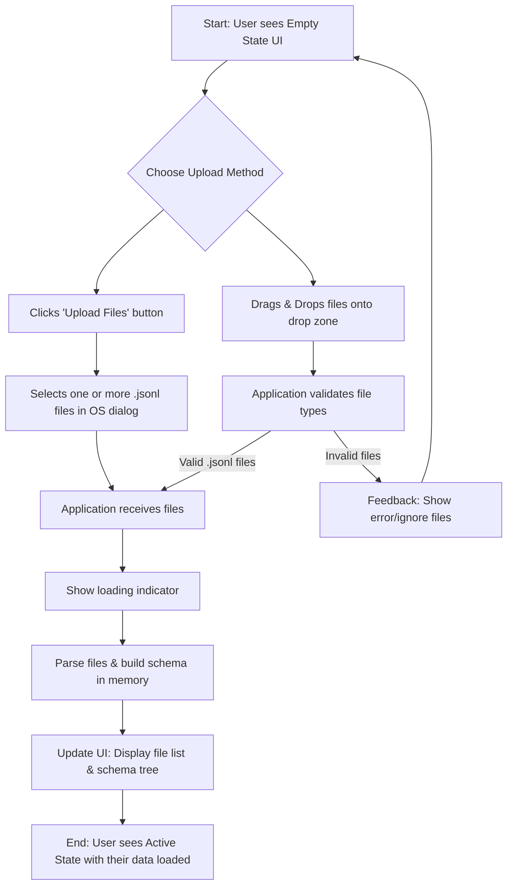
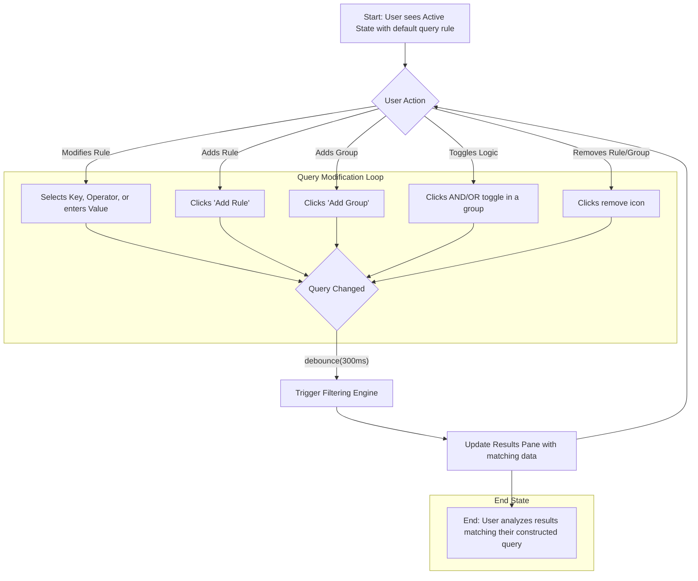
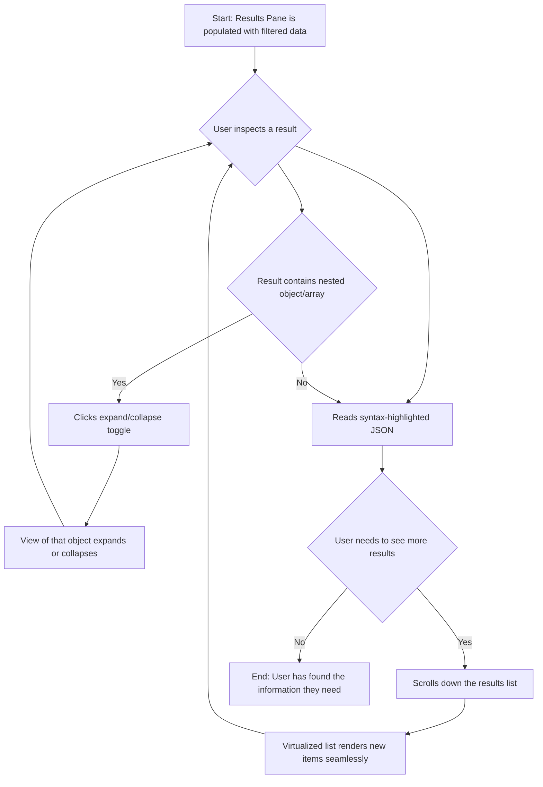

# Interactive JSONL Explorer UI/UX Specification

This document defines the user experience goals, information architecture, user flows, and visual design specifications for the Interactive JSONL Explorer's user interface. It serves as the foundation for visual design and frontend development, ensuring a cohesive and user-centered experience.

### Change Log

| Date | Version | Description | Author |
| :--- | :--- | :--- | :--- |
| 2024-07-30 | 1.0 | Initial draft of the UI/UX Specification | Sally (UX Expert) |

### Overall UX Goals & Principles

#### Target User Personas

*   **Developer:** Technical professionals who need to quickly diagnose issues by exploring and filtering structured log files. They value efficiency, keyboard accessibility, and a dense, information-rich interface.
*   **Product Manager:** Semi-technical users who want to understand application usage patterns from log data. They prioritize ease of use, clear visualizations, and an intuitive query-building process.

#### Usability Goals

*   **Discoverability:** New users should be able to upload a file and successfully build a basic query within 2 minutes of using the application without requiring instructions.
*   **Efficiency:** Experienced users should be able to construct complex, multi-level nested queries with minimal clicks and cognitive load.
*   **Performance:** The UI must remain responsive and fluid at all times, even when handling large files (up to 100MB) and displaying thousands of results.

#### Design Principles

1.  **Clarity Above All:** Prioritize a clean, uncluttered interface that makes the data the primary focus. Use typography, spacing, and a limited color palette to create a clear visual hierarchy.
2.  **Immediate Feedback:** Every user action—from uploading a file to modifying a query—should result in an immediate and obvious update to the UI.
3.  **Progressive Disclosure:** Start with a simple interface (the file upload prompt). Reveal more complex tools like the schema explorer and query builder only after they become relevant (i.e., after files are loaded).
4.  **Frictionless Workflow:** The core user journey of uploading, filtering, and viewing data should be a seamless and uninterrupted flow. Avoid modals or separate pages that would disrupt this process.
5.  **Accessible by Default:** Design and build for all users from the start, ensuring the application is fully usable via keyboard and screen readers, and that all color combinations meet WCAG AA contrast standards.

## Information Architecture (IA)

### Site Map / Screen Inventory

The application consists of two primary states: an initial **Empty State** for file uploads and a main **Active State** which contains the three-pane workspace. The transition between these states is triggered by the user uploading one or more valid JSONL files.

### Navigation Structure

*   **Primary Navigation:** Not applicable in a traditional sense. The user "navigates" from the Empty State to the Active State by performing the primary action of uploading files.
*   **Secondary Navigation:** Not applicable. All tools and content areas are simultaneously visible within the three-pane layout of the Active State.
*   **Breadcrumb Strategy:** Not applicable, as the application has a flat architectural structure with no deep hierarchical levels.

## User Flows

### Flow: File Upload and Schema Discovery

*   **User Goal:** To load one or more JSONL files into the application and understand the structure of the data they contain.
*   **Entry Points:** The initial "Empty State" view of the application, which features a prominent drag-and-drop zone and an "Upload Files" button.
*   **Success Criteria:** The user sees the names of their uploaded files in the sidebar, and a hierarchical schema tree is populated, showing all unique keys discovered from the data. The application transitions from the "Empty State" to the "Active State".

#### Flow Diagram

#### Edge Cases & Error Handling:

*   **User uploads non-JSONL file:** The application should ignore the file and provide clear, non-blocking feedback to the user.
*   **User uploads an empty file:** The file is accepted, but no new data or schema information is generated.
*   **File contains malformed JSON on some lines:** The application should gracefully skip the invalid lines, show a popup informing the user how many total lines were present and how many (and what percentage) of them were invalid, log the errors to the developer console for debugging, and process the rest of the file. The app must not crash.
*   **User cancels file selection dialog:** The application state remains unchanged.

### Flow: Dynamic Query Construction

*   **User Goal:** To interactively build a simple or complex query to filter the loaded data down to a specific subset of interest.
*   **Entry Points:** The "Active State" of the application, where the Query Builder pane is visible and populated with an initial, default filter rule.
*   **Success Criteria:** The user successfully adds, removes, or modifies filter rules and groups. The results view updates in near real-time with each change, showing the data that matches the current query.

#### Flow Diagram

#### Edge Cases & Error Handling:

*   **Query produces no results:** A clear "No results found" message is displayed in the results pane.
*   **Incomplete rule:** If a rule has a value-based operator (e.g., `equals`) but no value is entered, it should be treated as a non-match or ignored, without causing an error.
*   **User creates a very complex nested query:** The UI must handle this gracefully without breaking the layout. The filtering engine must correctly evaluate the logic.
*   **Rapid query changes:** The system should use a debounce mechanism to avoid re-filtering on every single keystroke in a value field, ensuring the UI remains responsive.

### Flow: Viewing and Analyzing Results

*   **User Goal:** To inspect the JSON objects that match their query, understand their content, and navigate large result sets efficiently.
*   **Entry Points:** The Results Pane, any time it is updated with new data after a query is executed.
*   **Success Criteria:** The user can clearly read the filtered JSON entries, expand and collapse nested objects/arrays to explore the data, and smoothly scroll through a large number of results without the UI becoming unresponsive.

#### Flow Diagram

#### Edge Cases & Error Handling:

*   **Very large number of results (e.g., 10,000+):** The UI must not attempt to render all results at once. A virtualization or pagination strategy is critical to prevent the browser from freezing. The UI should clearly indicate that it is only showing a subset of the total results (e.g., "Displaying 200 of 10,452 results").
*   **Very long/wide JSON objects:** The results view should handle these with appropriate text wrapping and/or horizontal scrolling within the result entry to avoid breaking the main layout.
*   **Empty or null values in JSON:** These should be rendered clearly (e.g., `null`, `""`) to distinguish them from non-existent keys.

## Wireframes & Mockups

### Primary Design Files

The primary source of truth for the application's visual and interactive design is the high-fidelity mockup. The existing HTML mockup serves as an excellent, functional prototype that establishes the layout, theme, and core component styling.

*   **Primary Mockup:** [`docs/design/ai-generated-mockup.html`](docs/design/ai-generated-mockup.html)
*   **Visual Style Reference:** [`docs/design/ui-mockup-v1.png`](docs/design/ui-mockup-v1.png)

### Key Screen Layouts

As a single-page application, the "screens" are states of a single view.

#### Screen: Empty State

*   **Purpose:** To provide a clear and immediate call-to-action for the user to load their data files. This is the application's landing experience.
*   **Key Elements:**
    *   A large, central drag-and-drop zone.
    *   A primary "Select Files" button within the drop zone.
    *   An alternative "Upload Files" button in the static left-hand pane for discoverability.
    *   Minimalist text guiding the user.
*   **Interaction Notes:** Dragging a file over the window should provide visual feedback (e.g., highlighting the drop zone border). Both the button and the drop zone initiate the "File Upload" user flow.

#### Screen: Active State

*   **Purpose:** To provide the main workspace for data exploration, combining schema discovery, query building, and results analysis into a single, cohesive view.
*   **Key Elements:**
    *   **Left Pane (Files & Schema):** Displays the list of loaded files and a collapsible tree view of the discovered data schema.
    *   **Top Pane (Query Builder):** An interactive area for adding, grouping, and removing filter rules.
    *   **Main Pane (Results):** A virtualized scrolling list of the JSON objects that match the current query, with syntax highlighting and collapsible sections.
*   **Interaction Notes:** Changes in the Query Builder should immediately (with a debounce) update the Results Pane. The schema tree in the Left Pane can be used to explore data structure but does not directly influence the query in this iteration. All three panes should be resizeable.

## Component Library / Design System

### Design System Approach

A new, lightweight design system will be created for this project, codenamed "Operator." It will be based directly on the styles defined in `ai-generated-mockup.html`. The goal is to create a small, reusable set of components that are highly consistent and tailored specifically to the needs of this application, rather than importing a large, general-purpose component library.

### Core Components

#### Component: Button

*   **Purpose:** To trigger an action or event, such as uploading a file or adding a filter rule.
*   **Variants:**
    *   **Primary:** Used for the main call-to-action on a screen (e.g., "Select Files"). Features a high-contrast background.
    *   **Standard:** Used for most actions (e.g., "Add Rule," "Add Group").
    *   **Icon Button:** A button that contains only an icon, used for repetitive or space-constrained actions (e.g., remove rule).
*   **States:** Default, Hover, Focus, Disabled. All states must have clear visual indicators.
*   **Usage Guidelines:** Use the primary button sparingly (typically once per view) to guide the user to the most important action.

#### Component: Form Inputs (Select, Text Input)

*   **Purpose:** To allow users to select from a list of options (Select) or enter freeform text (Text Input) as part of the query builder.
*   **Variants:** None. A single, consistent style is used for all inputs.
*   **States:** Default, Hover, Focus, Disabled. The focus state is critical for keyboard accessibility.
*   **Usage Guidelines:** `Select` elements should be used for the schema keys and operators. `Text Input` should be used for the filter values.

#### Component: Tree View

*   **Purpose:** To display hierarchical data, such as the discovered schema in the left pane and the nested JSON in the results pane.
*   **Variants:**
    *   **Schema Tree:** Used in the left pane for displaying keys and their types.
    *   **JSON Tree:** Used in the results view for displaying JSON objects with syntax highlighting.
*   **States:** Expanded, Collapsed.
*   **Usage Guidelines:** The tree view must be navigable and operable via keyboard (e.g., arrow keys to navigate, Enter/Space to expand/collapse).

#### Component: Query Rule

*   **Purpose:** A compound component that encapsulates a single line of filter logic.
*   **Key Elements:** Contains a `Select` for the key, a `Select` for the operator, a `Text Input` for the value, and an `Icon Button` to remove the rule.
*   **Usage Guidelines:** This is the fundamental building block of the query builder.

#### Component: Query Group

*   **Purpose:** A compound component that visually groups multiple `Query Rule` components and other `Query Group` components.
*   **Key Elements:** Contains a toggle `Button` for `AND`/`OR` logic, `Buttons` to "Add Rule" and "Add Group", and a container for the rules/groups themselves.
*   **Usage Guidelines:** Groups should be clearly delineated with a border and/or background color to show their scope and nesting level.

## Branding & Style Guide

### Visual Identity

The visual identity is "Operator Dark," a clean, minimalist, dark-themed aesthetic designed for technical tools. It prioritizes content, clarity, and functionality over ornamentation. No specific logo or brand imagery is required.

### Color Palette

| Color Type | Hex Code | Usage |
| :--- | :--- | :--- |
| Background | `#1a1b26` | Main application background |
| Background (Light) | `#24283b` | Panes, headers, rule containers |
| Background (Lighter)| `#414868` | Button backgrounds, borders |
| Foreground | `#c0caf5` | Primary text color |
| Foreground (Dark) | `#a9b1d6` | Secondary text, labels |
| Comment / Muted | `#565f89` | Meta-text, disabled elements |
| Accent | `#2ac3de` | Primary actions, focus indicators (Cyan) |
| Accent 2 | `#bb9af7` | Query group borders (Magenta/Purple) |

### Typography

*   **Primary Font (UI):** System UI fonts (`-apple-system`, `BlinkMacSystemFont`, `Segoe UI`, `Roboto`, etc.) for maximum legibility and native feel.
*   **Monospace Font (Data):** A modern monospace font with ligatures like `Fira Code` or `JetBrains Mono` for displaying schema and JSON results.

| Element | Size | Weight | Use Case |
| :--- | :--- | :--- | :--- |
| H2 | 1rem | Normal | Section titles (e.g., "Files", "Schema") |
| Body | 14px | Normal | All primary UI text, inputs, buttons |
| Small | 13px | Normal | Schema tree, JSON results view |
| Meta | 11px | Normal | Result metadata (source file, line number) |

### Iconography

*   **Icon Library:** A small, embedded SVG icon set for UI actions.
*   **Usage Guidelines:** Icons should be simple, line-based, and used consistently. Key icons include: `add`, `remove`, `group`, `drag-and-drop`.

### Spacing & Layout

*   **Grid System:** Not applicable. Layout is managed by the flexible three-pane structure.
*   **Spacing Scale:** A 4px-based scale is used for all padding, margins, and gaps:
    *   `xs`: 4px
    *   `sm`: 8px
    *   `md`: 16px
    *   `lg`: 24px
    *   `xl`: 32px

## Accessibility Requirements

### Compliance Target

*   **Standard:** Web Content Accessibility Guidelines (WCAG) 2.1, Level AA.

### Key Requirements

*   **Visual:**
    *   **Color Contrast:** All text must have a minimum contrast ratio of 4.5:1 against its background. All UI controls and graphical objects must have a minimum contrast ratio of 3:1. The current "Operator Dark" color palette meets these requirements.
    *   **Focus Indicators:** All interactive elements (buttons, inputs, links, tree view nodes) must have a highly visible focus indicator when navigated to via keyboard. The accent color (`#2ac3de`) should be used to draw a 2px outline.
    *   **Text Sizing:** Text must be resizable up to 200% without loss of content or functionality.

*   **Interaction:**
    *   **Keyboard Navigation:** All functionality must be operable through a keyboard interface alone. This includes file upload, all query builder actions (adding/removing rules/groups, changing values), and navigating the results list (scrolling, expanding/collapsing nodes). Logical tab order is essential.
    *   **Screen Reader Support:** All controls must be properly labeled with `aria-` attributes where necessary. The application structure (e.g., the three panes) should be communicated using landmark roles. The dynamic updates to the results pane must be announced to screen reader users.
    *   **Touch Targets:** While designed for desktop, touch targets should be at least 24x24 pixels to ensure usability on touch-enabled laptops.

*   **Content:**
    *   **Alternative Text:** All icons that are not purely decorative must have accessible names (e.g., via `aria-label`).
    *   **Heading Structure:** A logical heading structure should be used to organize the UI panes and sections.
    *   **Form Labels:** All form inputs (`select`, `input`) must have programmatically associated labels for screen readers.

### Testing Strategy

Accessibility will be checked continuously during development using a combination of automated tools (like Axe) and manual keyboard/screen reader testing. A full accessibility audit should be performed before the first official release.

## Responsiveness Strategy

### Breakpoints

While the primary target is desktop, the application should be usable across a range of screen sizes.

| Breakpoint | Min Width | Target Devices |
| :--- | :--- | :--- |
| Mobile | 320px | Small to large mobile phones |
| Tablet | 768px | Portrait and landscape tablets |
| Desktop | 1024px | Standard desktop and laptop screens |

### Adaptation Patterns
*   **Mobile:** The three-pane layout will collapse into a single-column, tabbed, or accordion interface to be usable on a narrow screen. The query builder may need to be simplified or moved to a separate view.
*   **Tablet:** The three-pane layout may be preserved, but the relative widths of the panes will adjust to better suit the screen proportions.
*   **Desktop:** The default three-pane layout as seen in the mockup.

## Next Steps

### Immediate Actions

1.  **Stakeholder Review:** This UI/UX Specification document should be reviewed and approved by the project stakeholders (e.g., Product Manager, Lead Developer).
2.  **Architectural Handoff:** The approved specification, along with the PRD and mockups, should be handed over to the System Architect to begin the front-end architecture and technical design phase.
3.  **Finalize Mockup Details:** While the existing mockup is high-fidelity, any minor interaction details or states not explicitly covered (e.g., specific error message styling) should be quickly prototyped or clarified.

### Design Handoff Checklist

This checklist confirms that the design specification is ready for the development team.

*   [x] All user flows documented
*   [x] Component inventory complete
*   [x] Accessibility requirements defined
*   [x] Responsive strategy clear
*   [x] Brand guidelines incorporated
*   [x] Performance goals established (via NFRs in PRD)
